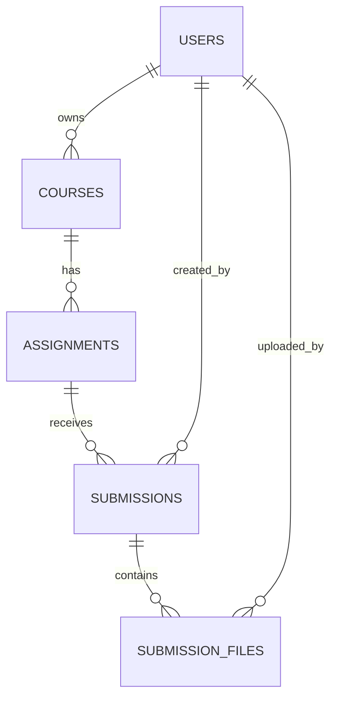

# Grader Backend

FastAPI service that coordinates assignment uploads, AI-assisted marking, and tutor reviews for COMP9900. It stores structured submission data in SQLite/Postgres, keeps raw files on disk, synchronises marking results into JSON, and offers automation hooks to the `AI/` pipeline inside this repo.

---

## Tech Stack
- FastAPI + Pydantic v2 for APIs and schemas (`app/main.py`, `app/routers/*`)
- SQLAlchemy ORM for persistence (`app/models.py`, `app/db.py`)
- JWT authentication with Passlib hashing (`app/security.py`, `app/routers/auth.py`)
- Background tasks & file orchestration for multi-step submissions (`app/routers/submissions.py`, `app/utils/*`)
- JSON-based marking ledgers per course (`app/routers/marking_result_manage.py`)
- AI integration hooks to `AI/s*` scripts (`app/services/*`, `app/routers/ai_router.py`)
- Utility scripts for tutor mark extraction and CSV exports (`app/tutor_marking_extract.py`, `app/collect_marking_result_in_csv.py`)

---

## Repository Layout
```
backend/
├── app/                     # Primary FastAPI application package
│   ├── routers/             # REST endpoints: auth, courses, assignments, submissions, AI, marking
│   ├── services/            # AI bridge + marking synchronisation helpers
│   ├── utils/               # Upload paths, file metadata, submission status helpers
│   ├── models.py            # SQLAlchemy ORM models
│   ├── schemas.py           # Pydantic response/request models
│   ├── config.py            # Settings + environment handling
│   ├── tutor_marking_extract.py
│   └── collect_marking_result_in_csv.py
├── uploads/                 # Runtime storage for assignment specs + submissions
├── marking_result/          # JSON ledgers, one file per course+term
├── marking_result_csv/      # CSV exports generated by collect_marking_result_in_csv.py
├── dev.db                   # Default SQLite database (auto-created)
├── pyproject.toml | requirements.txt
└── README.md                # This document
```

---

## Getting Started

1. **Install dependencies**
   ```bash
   cd backend
   poetry install        # preferred
   # or
   pip install -r requirements.txt
   ```

2. **Configure environment** (`backend/.env`)

   | Variable | Purpose | Default |
   | --- | --- | --- |
   | `SECRET_KEY` | JWT signing key (required) | _none_ |
   | `ACCESS_TOKEN_EXPIRE_MINUTES` | JWT TTL | `120` |
   | `SQLALCHEMY_DSN` | Database URL (`sqlite:///./dev.db` or Postgres DSN) | `sqlite:///./dev.db` |
   | `POSTGRES_*` | Optional Postgres connection pieces | - |
   | `UPLOAD_ROOT` | Root folder for assignment assets | `uploads/` |
   | `MAX_UPLOAD_MB` | Max upload size per file | `50` |
   | `ALLOWED_EXTENSIONS` | Comma-separated whitelist | `pdf,doc,docx,txt` |

3. **Run the API**
   ```bash
   poetry run uvicorn app.main:app --reload --host 127.0.0.1 --port 8000
   ```
   On startup `app/main.py` auto-creates tables and enables permissive CORS for local frontend work.

4. **Optional: seed a coordinator**
   - Call `POST /v1/auth/register` with email/password.
   - Use `POST /v1/auth/login` to obtain a JWT for subsequent requests (`Authorization: Bearer <token>`).

---

## Data Model & Storage

`app/models.py` defines the relational structure below (mirrored in the ER diagram used by the frontend designer):



**On-disk folders**

```
uploads/
  <course>-<term>/
    <assignment-slug>-<assignment_id>/
      spec/ | rubric/         <-- files supplied during assignment creation
      submissions/
        Student_assignment_with_coordinator_mark/<zid>/{zid}_assignment.*
        Student_assignment_with_Tutor_mark/<zid>/{zid}_assignment.* / {zid}_mark.*
        ...step-specific variants per ActorRole/PartKind
marking_result/<year>_<TermX>/<course>.json
marking_result_csv/<year>_<TermX>/<course>.csv
```

Each course owns a JSON ledger containing `marking_results` plus an `ai_completed` toggle. Tutor and AI pipelines write into the same record (keyed by `zid`) via `app/services/marking_sync.py`.

---

## Key Workflows

### Authentication & Security
- Passwords are hashed with Passlib (`pbkdf2_sha256`).
- JWT tokens are issued via `app/security.create_access_token` and validated in `app/deps.get_current_user`.
- Use `Depends(require_role(...))` whenever coordinator/tutor separation is needed (currently only `get_current_user` is enforced).

### Course + Assignment lifecycle (`routers/courses.py`, `routers/assignments.py`)
- Creating a course also bootstraps an empty JSON ledger under `marking_result/<year>_<TermX>/<code>.json`.
- Assignments accept spec + rubric uploads in PDF or Word format. Files are stored under `uploads/` and metadata is persisted into `meta.json`.
- Updating assignment files enforces MIME/signature validation (PDFs must start with `%PDF-`).

### Submission pipeline (`routers/submissions.py`)
- Coordinators upload student submissions in six logical steps. `stepIndex` is mapped to `(ActorRole, PartKind)` via `_role_kind_from_step`.
- Student folders follow `uploads/.../submissions/<role bucket>/<zid>/<zid>_{assignment|mark}.*`.
- Tutor mark uploads (step 6) trigger `services.marking_sync.sync_tutor_mark_from_file` which parses doc/docx/pdf via `TutorMarkExtractor` and upserts JSON results.
- AI staging files (step 5) enqueue `run_ai_marking_pipeline` in a background task; see below.
- `compute_status` ensures both coordinator and tutor deliverables exist before flagging `READY_FOR_REVIEW`.
- Bulk coordinator uploads (`POST /v1/submissions/bulk`) auto-extract `zid` from filenames.

### Marking result management (`routers/marking_result_manage.py`)
- Core operations:
  - `GET /v1/marking_result/by_id/{course_id}` – read the ledger associated with a DB course.
  - `POST /v1/marking_result/{course_id}/append` – upsert a record by `zid`, automatically calculating score differences and whether `needs_review` exceeds the `_REVIEW_DIFF_THRESHOLD` (20%).
  - `GET/PUT /v1/marking_result/{course_id}/status` – toggle `ai_completed`.
  - `GET /v1/marking_result/by_code/{course_code}?year=2024&term=3` – lookup purely by filesystem structure.
- Storage is atomic: writes happen via `save_json_atomic` to prevent corruption.

### AI integration (`routers/ai_router.py`, `services/ai_runner.py`, `services/ai_bridge.py`)
- `POST /v1/ai/init/{assignment_id}` copies the assignment spec/rubric into `AI/artifacts/rubric/` and runs `AI.scripts.rubric_assign_req.process_pipeline` in the background.
- `POST /v1/ai/run` invokes `AI.scripts.predict_scores.run_predict_pipeline` for batch inference and can optionally POST back to `/v1/marking_result/{course_id}/append`.
- `POST /v1/ai/sync/{assignment_id}` reads the latest AI predictions (default path `AI.scripts.config.LLM_PREDICTION`) and merges them into the JSON ledger via `sync_ai_predictions_from_file`.
- `services/ai_runner.run_ai_marking_pipeline` is triggered automatically when tutor uploads step 5 assignments: it stages student files into `AI/data/test`, runs the pipeline, and syncs results.

### Tutor mark extraction & manual ingestion
- `TutorMarkExtractor` parses DOC/DOCX/PDF using `python-docx` and `PyMuPDF (fitz)` to extract per-criterion scores plus totals.
- `POST /v1/marking_result/extract` lets coordinators point to a `Student_assignment_with_Tutor_mark` directory. Each mark file is parsed and POSTed to `/v1/marking_result/{assignment_id}/append`, enabling retroactive imports.

### CSV exports (`app/collect_marking_result_in_csv.py`)
- Converts every JSON ledger into a flattened CSV featuring base columns + dynamic rubric columns (both tutor and AI).
- Usage:
  ```bash
  cd backend
  poetry run python app/collect_marking_result_in_csv.py marking_result/2024_Term3
  # or export a single file
  poetry run python app/collect_marking_result_in_csv.py marking_result/2024_Term3/comp9900.json
  ```
- Outputs land in `marking_result_csv/<year>_<TermX>/<course>.csv`.

---

## API Cheatsheet

| Domain | Endpoint | Notes |
| --- | --- | --- |
| Auth | `POST /v1/auth/register` | Create coordinator (email + password). |
| Auth | `POST /v1/auth/login` | Returns `{access_token}` (JWT). |
| Courses | `POST /v1/courses` | Creates DB row + JSON ledger scaffold. |
| Courses | `GET /v1/courses` | List courses owned by current user. |
| Courses | `DELETE /v1/courses/{id}` | Removes DB row + associated JSON file. |
| Assignments | `POST /v1/assignments/create_with_files` | Upload spec + rubric simultaneously. |
| Assignments | `PUT /v1/assignments/{id}/files` | Replace spec/rubric; enforces MIME/signature checks. |
| Submissions | `POST /v1/submissions` | Create one submission with up to six steps. |
| Submissions | `PUT /v1/submissions/{id}/files` | Append additional files for a step. |
| Submissions | `POST /v1/submissions/bulk` | Mass coordinator upload (step 3). |
| Marking Results | `GET /v1/marking_result/by_id/{course_id}` | Retrieve ledger JSON. |
| Marking Results | `POST /v1/marking_result/{course_id}/append` | Upsert `zid` record with AI/tutor numbers. |
| Marking Results | `GET/PUT /v1/marking_result/{course_id}/status` | Manage `ai_completed`. |
| Marking Results | `POST /v1/marking_result/extract` | Parse an existing tutor mark folder. |
| AI | `GET /v1/ai/health` | Verifies importability of AI scripts. |
| AI | `POST /v1/ai/init/{assignment_id}` | Kick off rubric/spec ingestion. |
| AI | `POST /v1/ai/run` | Fire predict pipeline (optionally auto-post results). |
| AI | `POST /v1/ai/sync/{assignment_id}` | Merge AI predictions into ledger. |

Swagger docs are available at `http://127.0.0.1:8000/docs` when the server is running.

---

## Development Tips
- **Database**: SQLite (`dev.db`) is fine for local development; switch `SQLALCHEMY_DSN` to Postgres for production. Tables auto-create on startup via `Base.metadata.create_all`.
- **Uploads cleanup**: Since files are stored on disk, periodically archive `uploads/` and `marking_result/` when running long-lived test suites.
- **Error handling**: Most routers raise FastAPI `HTTPException`; check server logs for additional tracebacks (especially around background tasks and AI integration).
- **AI folder imports**: `ai_router` and `services/ai_runner` prepend both repo root and `AI/` to `sys.path`. Keep the AI submodule present locally, otherwise health checks will fail.
- **Extending roles**: `deps.require_role` is ready for stricter RBAC if/when more roles are introduced.

---

## Common Commands
```bash
# Run API (auto-reload)
poetry run uvicorn app.main:app --reload

# Format / lint (if you opt in)
poetry run black app
poetry run isort app

# Manual tutor mark sync for a single file
poetry run python -c "from app.services.marking_sync import sync_tutor_mark_from_file; ... "

# Export JSON -> CSV
poetry run python app/collect_marking_result_in_csv.py marking_result/2024_Term3
```

This README was authored after a line-by-line review of the FastAPI backend so it reflects the current behaviour of every router, service, and utility.
