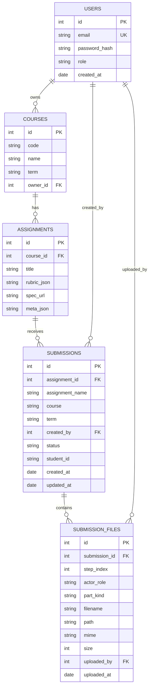

[](https://classroom.github.com/online_ide?assignment_repo_id=20528448&assignment_repo_type=AssignmentRepo)

# Backend (FastAPI + SQLAlchemy)

FastAPI service powering the CAKE platform. It exposes `/v1/**` routers for authentication, courses, submissions, AI orchestration, and system logs. The codebase is structured as follows:

| Directory/File | Purpose |
|----------------|---------|
| `app/main.py` | FastAPI entry point, middleware, router registration. |
| `app/models.py` | SQLAlchemy ORM definitions (Users, Courses, Assignments, Submissions, SubmissionFiles, SystemLogs). |
| `app/db.py` | Engine/session setup, Alembic readiness. |
| `app/routers/` | Modular route handlers (auth, submissions, marking_result, AI, logs, etc.). |
| `app/services/` | Job queue, AI runner, marking sync, system log helpers. |
| `app/utils/` | Shared helpers (paths, job queue accessor, submission status). |
| `tests/` | Pytest suites (unit + future integration tests). |

## Data Model



## Getting Started

```bash
cd backend
poetry install --all-extras --with dev   # dependencies (app + dev tools)

# run API
poetry run uvicorn app.main:app --reload --host 127.0.0.1 --port 8000
```

Environment variables (example `.env`):

```
DATABASE_URL=sqlite:///app.db
JWT_SECRET=super-secret
OPENAI_API_KEY=sk-...
```

## Testing

```bash
cd backend
poetry run pytest --cov=app --cov-report=xml
```

Quick targeted runs:

```bash
poetry run pytest tests/test_submission_status.py
poetry run pytest tests/test_marking_sync_utils.py
```

Current automated coverage:

- `app.utils.submission_status.compute_status` (all states).
- `app.services.marking_sync` helpers for scoring normalization.

Add future tests under `backend/tests/`, preferring:

- Pure unit tests for utilities.
- FastAPI `TestClient` suites for routers/services.
- Job-queue/AI flow tests that mock external AI scripts when needed.

## Tooling

- **Formatting**: `poetry run black app`, `poetry run isort app`
- **Security**: `poetry run bandit -q -r app`, `pip-audit`
- **Env**: Python ≥3.12 (matches CI), Poetry ≥1.8

Keep this file updated as new modules, scripts, or testing strategies are added.
